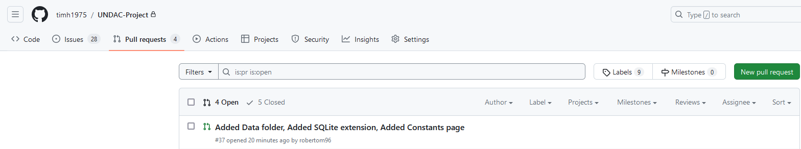
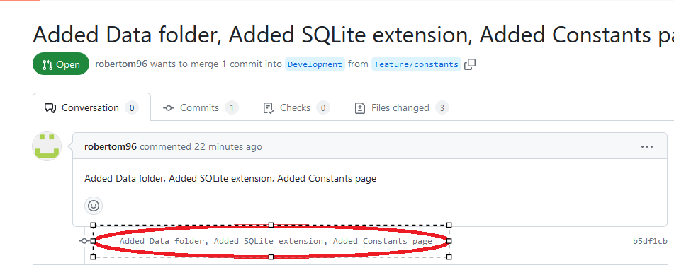
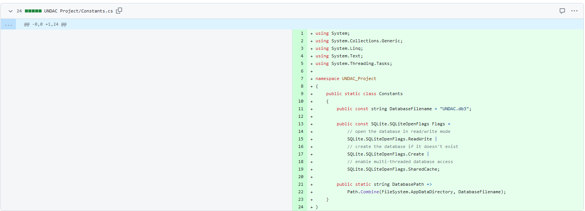
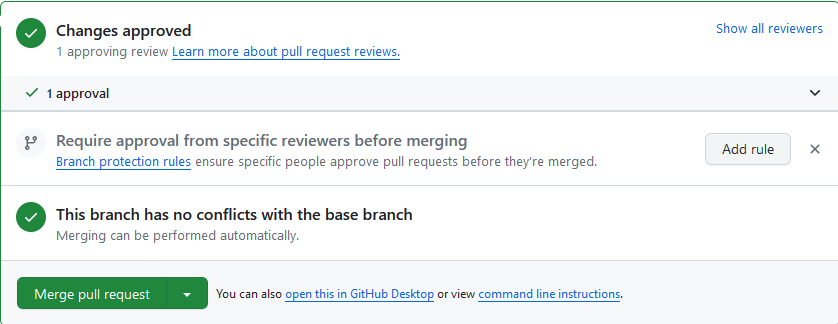
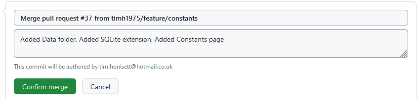

## Contents
1.  [Code Review](#code_review)

## Code Review

The GitHub account was setup so that any merges from a feature branch to the development bracnh required a pull request.  The purpose of this was to ensure that the code can be viewed directly in GitHub prior to merge. If there was any issues with the code, the pull request could be revolked and feedback provided. That way the code would be kept clean prior to merging.

Here, I am reviewing the datatabase constrants class directly in GitHub. 

Firstly, I viewed the Pull Requests from the main menu in GitHub to view awaing PRs (fig 1).  The top PR was selected

**fig 1 (view pull requests)**

Next, the link circled in red was clicked (fig 2) to view changes made in the pull request (fig 3)

**fig 2 (select PR link)**

The code marked in green in figure 3 is the requested changes made. This was the code that was reviewed

**fig 3 (view PR request code)**

The code was viewed line by line. This review was very straight forward as the constant class was the same as the ToDoList task.  The developer confirmed that their changes worked on their own feature branch. Given this and that the code matched the ToDoList project which I knew worked, I was able to approve the code and the PR merge into the development branch.

Once the feedback was sent back to the developer, the merge process to the development branch began using the following steps

**step 1 - click on Merge pull request**

**step 2 - click on confirm merge**

**step 3 - merge of branches confirmed**

