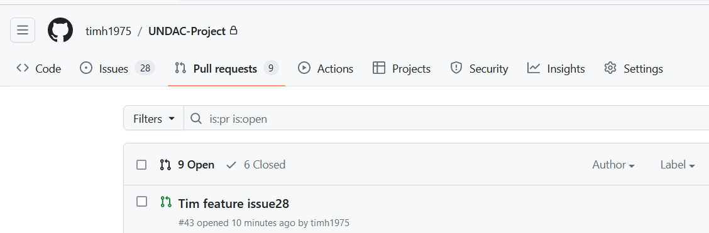
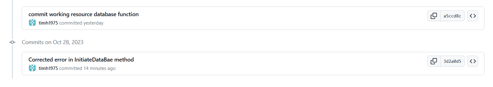
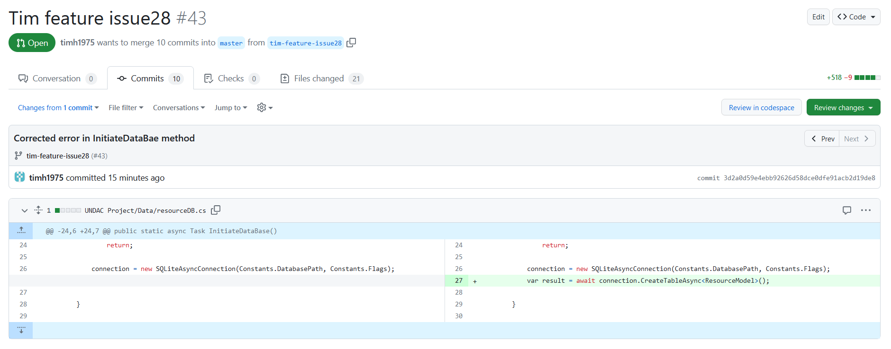
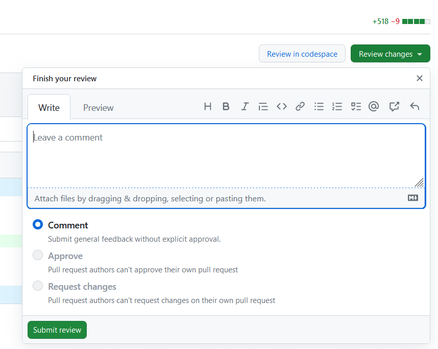
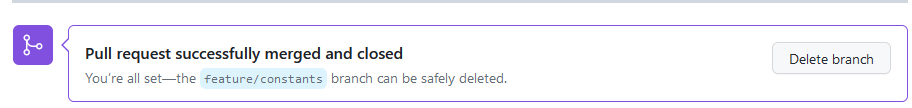

## Contents
1. [Accept an issue from the backlog](#accept-an-issue-from-the-backlog)
2. [Follow the team workflow through to pull request](#follow-the-team-workflow-through-to-pull-reques)
3. [Add document comments](#add-document-comments)
4. [Code Review](#code_review)
5. [Merge feature branch into development](#merge-feature-branch-into-development)
6. [Fix indentified problems](#fix-identified-problems)

## Accept an issue from the backlog

Accepted an issue from the backlog before starting on the new feature branch.

## Follow the team workflow through to pull request

Prior to undertaking the new feature for the issue, the issue was moved from the kanban board to the in progress status.  Once I tested my branch on my local machine, I requested a pull request for a code review. A code was identified and fixed as discussed later. Once the fix was appleid and feature branch pushed to github, the issue was moved to the tested/ready section of the kanban board.

## Add document comments

Doxygen was used to create documentation of the class/methods that I created for my feature branch.  This was copied and pasted into a markdown file and stored in GitHub repo.

## Code Review

Prior to merging the feature branch into the devleopment, a code review on GitHub project repo is required first.

In this scenario, I reviewed the code that sets up the initiation of the database. Given that the same code applies to the ToDoList and that the developer confirmed that it worked on their local machine, I was able to review and approve the code segment quickly.

Below, shows how I did this directly in the GitHub repo.

Firstly, selelec the Pull Request section in the header and click on the branch you wish to review (fig 1)

**fig 1 (view pull requests)**

Next, find the commit you wish to perform a code reivew on (fig 2)

**fig 2 (select commit to review)**

The code marked in green in figure 3 is the requested changes made. This was the code that was reviewed

**fig 3 (view PR request code)**

The code base marked in green was reviewed.  Once reviewed, click on Review Changes button on the top right hand side of the scren. Here, you can leave a comment, approve the request or request changes. Please note that the personal who created the Pull Request cannot approval or request their own changes (fig 4)

**fig 4 (comment and approve/reject pull request)**

## Merge feature branch into development 

In the Pull requests tab, click on Merge Pull request (fig 5)

**fig 5 - click on Merge pull request**

Click on confirm merge (fig 6)

**fig 6 - click on confirm merge**

Merge now confirmed

**fig 7 - merge of branches confirmed**

## Fix indentified problems

Other students used my feature branch as a way of identifying how to write code to deal with the project. During this stage of them exploring my code base, it was identified that a line required to create a new database table in the local database was missing. Once this was identified, I updated my feature branch with the fix and psuhed back into github for code review.
