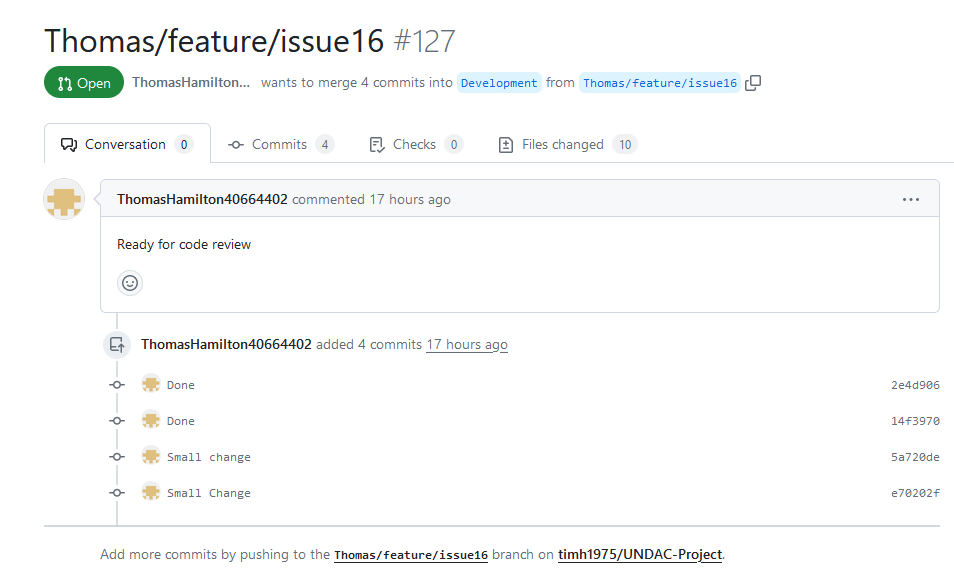
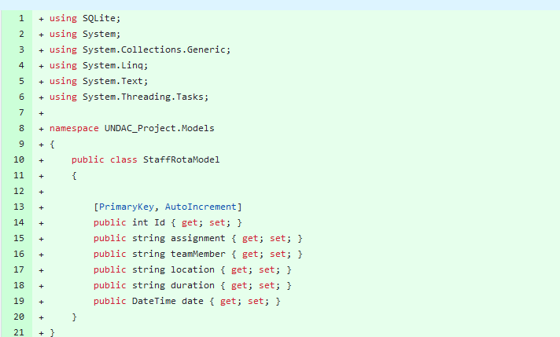
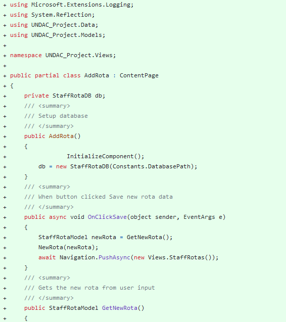
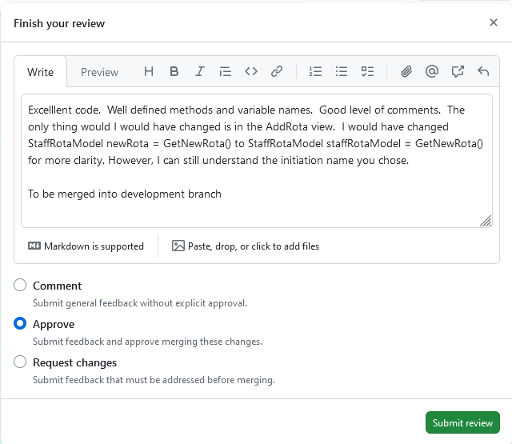
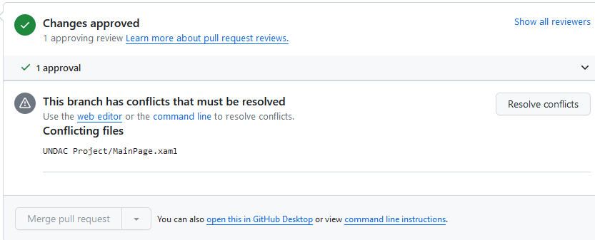
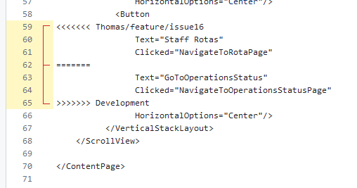
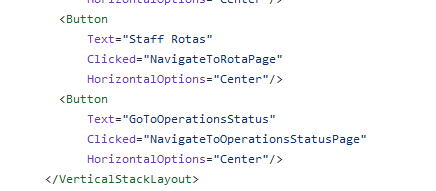
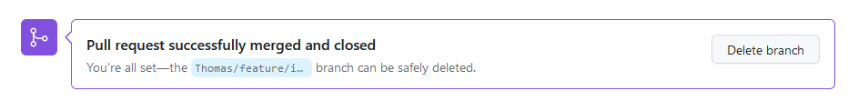
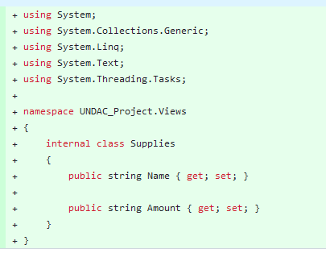

# Portfolio - Week 12 - TIm Honisett - 40595819

## Code Review 1 ##

In the branch tab in GitHub, I could see that the below feature branch was ready for review (fig 1). The workflow requires that a Code Review is undertaken and only merged into the development branch once approved. This is to ensure code quality is applied to the pull request.  Often, I have noticed that merge requests have merge conflicts as discussed below.

**fig 1**

The code segment below was clear in that all the variable names were meaningfull and the datatypes matched what was expected from the variable name. For example, the DateTime was used for the date variable and int was used for the ID.  The model fitted the requirements of the Model, View architecture. (fig 2)

**fig 2**

The code segment below was again clear with good level of comments. However, the line StaffRotaModel newRota = GetNewRota was not particularly clean. Instead, I would have susggested using something on the line of StaffRota staffRota = GetNewRota. (Fig 3)

**fig 3**

Once I reviewed the code, I added the comments and approved for changes. I decided to accept the changes as they did not neccessarily affect the code quality and that the project was comming to an end (fig 4).

**fig 4**

I needed to resolve conflict merges prior to merging the feature branch into the development. Here, I was able to resolve the merge conflicts directly in GitHub (fig 5)

**fig 5**

Here is an example of a merge conflict.  The branch that requires merges has conflicts on lines 62 where a <Button label should have been added(fig 6). This was fixed by adding the button element.  The MAUI page would have failed to load if this fix was not applied.  See figure 7 for the change made.

**fig 6**

**fig 7**

Once the conflict merges were fixed, I was able to merge pull request. (fig 8)

**fig 8**

Following the workflow, once the feature branch is merged into the Development branch, it is deleted from the remote repo (fig 9).

**fig 9**

## Code Review 2 ##

The following code review (fig 10) shows poor code.  The variable Amount data type is a string. Furthermore, it is not clear whether the amount requires to a quantity or a cost.  If it is a quantity, then the integer datatype should be used, otherwise a float if the amount is a cost.

## Reflection ##

# Workflow #

At the beginning of the project, the team chose to use Zube for the Kanban Board from prevous experience.  However at the time, we did not realise that we signed up for a trial period and had to pay subscription after a month.  Instead, we used Project with GitHub as a Kanban Board.  This move required extra work. We found that there was no way of adding to the backlog directly from Zube so that we had to add items manually. Zube Kanban board was easier to update the status of a task. However, in GitHub alot of the tasks were not being updated from either myself or the team. Instead, I was relying on pull request tab to check what was required for Code Review or what was ready for merging. This process required that those being reviewed or reviewing needed to keep up to date notes during the review process. There were times when I had to use social media  platforms to ask the team on the status of their branch review.  

In reflection, the following improvments would need to be applied. 

1.  Identify a free option Kanban and agree on useage before project.
2.  Ensure that the board is kept updated when a status of an issue has changed.
3.  Ensure GitHub comments are added when undertaking Code Review, status of review and if they are ready for merging into the development/master branch.

## Git and GitHub ##

This project has provided me with ample opportunity to development my git and GitHub skills.  The main area of development was around indentifying and correcting merge conflicts.  Whilst I am confident in dealing with these issues, the large amount of merge conflicts demonstrated that Git and GitHub was not used effiency.  Frequent changes of the same files appears to be the main cause of this. 

I had several issues for myself.  I did not apply commits frequenly enough. This means that I would not be able to revert small changes if there was an issue with my code.  Due to code issues, I was frequently not able to merge the remote development branch to my local repo. I had to correct code issues in files directly in GitHub before I can pull the remote development branch.  I deleted my local repo often and re-cloned from the remote.  This caused issues where I had no saved local commits if I needed to revert code.  Where there was an issue with pulling from the remote development branch, I had to go into GitHub and edit files correctly to fix errors.

One of the frequent issues I came across in conflict merges where that nugent packages were added during development and that versions where changed. Whilst, I recognise that this was due to team members adding in required packages whilst learning during the project, I recognise that having adding extra packages could cause issues with incompatability issues with other colleage's code base.  

The project also allowed for the development of my markdown file skills and how to convert this to PDF.

In reflection, the following improvments would need to be applied.

1. Commit changes frequently
2. The workflow needs to be more robust to deal with code issues with the development branch.  It is appearant that poorly tested code had been merged into the development branch.  It would be proposed that team members should merged the remote development branch onto their local copy.  Once merged, test their code and fix any issues. Pull requests must only take place once it is confirmed that the new feature works with what is in the remote.
3. Everyone should stick to using the same packages/libararies and versions.

## Coding skills and qaulity ##

My limitation was working with only one issue.  The issue needed to Equipment. This required the development of three database tables, three models, three views and one database class.
I followed the example of the ToDoList database in terms of it's architecture what is a view, model, and database classes.  I would have improved this by adopting the Model, ViewModel, Database level architecture.  This would ensure that the model cannot directly access the database, rather it would need to use the ViewModel.  This has the advantage of adding a layer of abstraction and that the data class model could be modified without the need of making changes to the view mode.  A designer could create the view without the need to understand how the database layer works and not need to make amendments what the database class is modified.

This project has introduced me to the MAUI framework and the concept of async programming. I learn how to address the issue of adding a Foreign Key in SQLite and sharing this with colleagues.  I made my first feature branch avaiable to other team members so that they had a starting point.

I took on positive critism from my own code review in week 9 and amended these recommendations in week 10 and created a new pull requests for the amendments.  These comments were on lack of comments and unclear variable names.

In reflection, the following improvement would need to be applied.

1.  Agree to the appropriate achitecture prior to commensing the project.
2.  Identify and agree frameworks and libraries early in the project
3.  Add appropriate comments
4.  Adopt better naming conventions for variables.

## Code reviews ##

I spend a large part of the project reviewing code and correcting merge conflicts.  As the project is based on the architecture of the ToDoList application, it was easy to identify how the code should be layed out. The code review issues I found and commented on are
  1.  Lack of comments
  2.  Code being commented out
  3.  Variable names for class instances not consistent.

Once I conducted a review, I would add comments. If the review passes, I would fix any merge conflict errors prior to merging the branch into the development branch.
