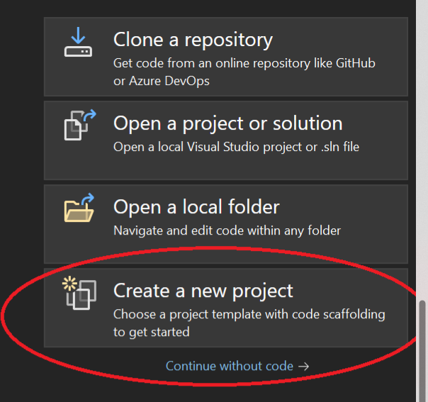

### Week 2 Portfolio for Software Engineering SET09102
## Tim Honisett 40595819

# GitHub and repo setup

Given that I already had a GitHub account and wished to get more experience in using the platform, I volunteered to setup the group account

The following steps were undertaken to acheive this

Firstly, open up Visual Studio and create a new project

Search for MAUI template and choose .NET MAUI App

