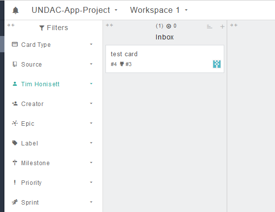

# Week 2 Portfolio for Software Engineering SET09102
## Tim Honisett 40595819

###### List of contents
1.  [GitHub and repo setup](#github-and-repo-setup)
2.  [Setting up a project in GitHub with integrated task board](#setting-up-a-project-in-gitHub-with-integrated-task-board)
3.  [Configuring a personal copy of visual studio appropriately](#configuring-a-personal-copy-of-visual-studio-appropriately)
4.  [Cloning the shared repository](#cloning-the-shared-repository)
5.  [Reflection](#reflection)
-------------------------------------------------------------------------------------------------------------------------------------------

### GitHub and repo setup

Given that I already had a GitHub account and wished to get more experience in using the platform, I volunteered to setup the group account

The following steps were undertaken to acheive this. **Please note that these steps create a new remote repo, not clone it**

Firstly, open up Visual Studio and create a new project

Search for MAUI template and choose .NET MAUI App then click on Next at the botton right hand side of the screen

Choose the same of the project and click on next

In Additional information, select .NET 6.0. This was chosen over .NET 7.0 as the newer version is only a short term support release.

Once the project has been built, click on Add to Source Control which is found at the button right hand side of the screen.  

The Create a Git repository dialog box will appear. As Visual Studio was already linked to my GitHub account, i did not need to provide these details.
Visual Studio default .gitignore template was added to prevent unncessary files unrelated to the project from being pushed to the remote depository.
It was dicided to keep the repository private to mitigate against plagiarism

Once the details have been entered, click on Create and Push

The remote repository will now appear in GitHub.

As the repository is private, collaborators were added using the settings tab.  Email invites were sent out to their academic addresses

----------------------------------------------------------------------------------------------------------------------------------------------------
### Setting up a project in GitHub with integrated task board

The project has already been set up as described above.  

Another team member has set up the Kanban board using zube.io

To check that the Kanban board was integrated with GitHub, I raised a test card and assigned it to myself.

To check that this test card appears on GitHub, I opened the Issues tab and the card appeared as open

----------------------------------------------------------------------------------------------------------------------------------------------------
### Configuring a personal copy of visual studio appropriately

Visual Studio 2022 version 17.4 already installed on machine.  .NET MAUI confirmed by looking at Visual Studio installer tool

Microsoft SQL Server was installed as part of the requirements for the project. SQL Server 2022 Develop was installed from https://www.microsoft.com/en-gb/sql-server/sql-server-downloads
The Basic installation type was chosen as default configuration is only required.  More customisation will be added once the database requirements have been identified.

Once the installation has been completed, the user can either connect to an existing database, customise or intall SSMS which is a tool to allow the user to manage the database in a graphical environment

----------------------------------------------------------------------------------------------------------------------------------------------------
### Cloning the shared repository

As I am the owner of the group repo, cloning the shared repository was not applicable as I created the local repository before creating and pushing to the remote repo

### Reflection

A particular strenght is that I undertook Software Engineering Methods last year which gave exposure to Scrum principles, Kanban boards, Continuous Improvement, Version control using git and, GitHub. This has helped in supporting fellow third year direct enterant students. However, I found using vesion control and GitHub problematic last year as I didnt read up enough on these subjects. Despite this, I am learning these skills again from scratch in order to be more efficient in these technical skills so that I can support the team when the project starts.

Whilst there were no particular challenges this week. However, the main challenges are to learn effective version control and GitHub management given that I had issues with using git last year and that I am managing the group repo. A further challenge is to learn using MAUI as this is a template I have not had previous exposure to this.

