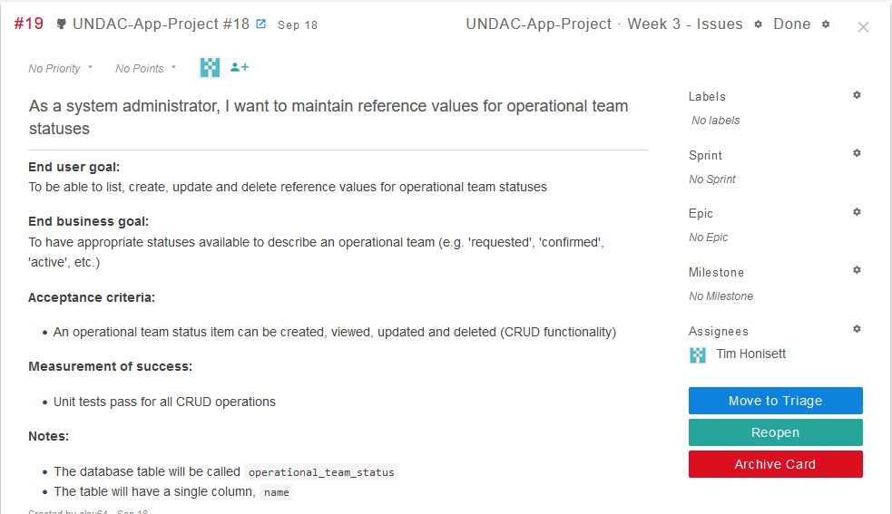
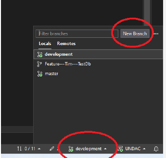
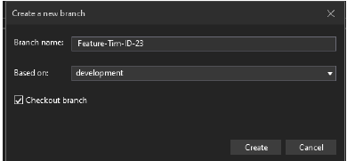

# Software Engineering - SET09102 - Portfolio for week 3 
## Tim Honisett - 40595819

## list of contents
1.  [Geting Starting with .NET MAUI](#geting-starting-with-.net-maui)
2.  [Team Workflow](#team-workflow)
3.  [Import the issue list](#import-the-issue-list)
4.  [Individual development tasks](#individual-development-tasks)
5.  [Continuous integration](#continous-integration)

### Geting Starting with .NET MAUI

The first step was to follow instructions on Getting Started in creating a [MAUI app](https://learn.microsoft.com/en-us/dotnet/maui/tutorials/notes-app/).  The next step was to add a [SQLite database](https://learn.microsoft.com/en-us/dotnet/maui/data-cloud/database-sqlite) to the project. 

The starter program [notes](https://github.com/timh1975/Notes) which is in my personal GitHub repository is based on the tutorials as linked above. At present, only records can be created.  The next step is to update and delete records.  This application will be used to inform programming knowledge when developing the actual UNDAC project.

Once a .NET MAUI project was created, the nugent sqlite-net-plc was added to the project (See figures 1 to 4 to follow the process of installing the package)

Right click on tools in the main menu, Nugent Package Manager than Manage NuGent Packages for Solutions
(See figure 1)

**(figure 1)**

Manage Packages for Solution screen will now appear.  In the Browse tab, enter sqlite-net-pcl in the search bar (see figure 2)

**(figure 2)**

Highlight the package (1), choose the project and solution to add the package to (2) and click on install. (see figure 3)

**(figure 3)**

Click on apply to add changes to the project/solution (see figure 4)

**(figure 4)**

The package will now install

### Team Workflow

The team workflow was agreed on 18th September 2023.

A Kanban board using Zube has been set up and will be used, using the following headings

  1.  Tasks
  2.  In Progress
  3.  Blockers
  4.  In Review
  5.  Completed

A pull request will be issued when a developer wishes to merge a feature branch into the development branch

A development branch was created from main branch. All feature branches. As the knowlege of the module grows, team members can amend workflow.md as neccessary.

### Import the issue list

A list of the issues were added to the Kanban board by another team member. It was agreed that team members can assign themselves tasks based on their confidence. The workflow of assigning an issue is to move the issue into in progress on the Kanban board, create a new feature branch for that issue, and pushing feature to the remote repo.

### Individual development tasks

I have assigned myself an issue (fig 5), created a new feature branch (fig 6 and 7) in visual studio and pushed to GitHub repo (fig 8). 

**(figure 5) select issue from backlog**

**(figure 6) step 1 to create new branch in visual studio**

**(figure 7 )step 2 to create new branch in visual studio**

The next step was to create a feature branch on my local machine followed by pushing it to the remote repo (fig 8)

**(figure 8) push mew branch to remote repo from visual studio**

The issue was moved to in progress on the board (fig 9 ). 

This issue will remain in progress until the feature branch has been worked on between week 6 and 8 of the module.

**(figure 9) move issue to in progress**

### Continous integration

Given the time taken to get familiar with .NET MAUI and asyncrinous SQLite database managedment, Continuous Integration will be explored in depth before the actual project gets underway.
