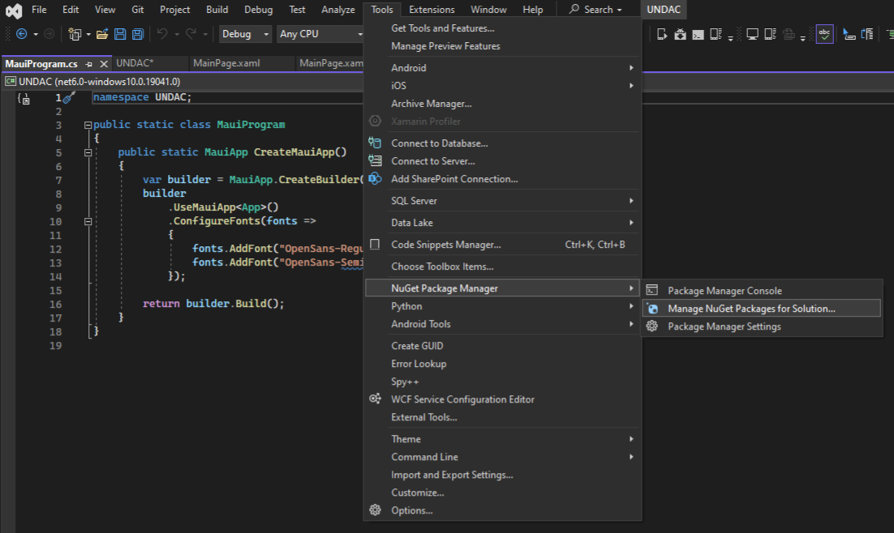
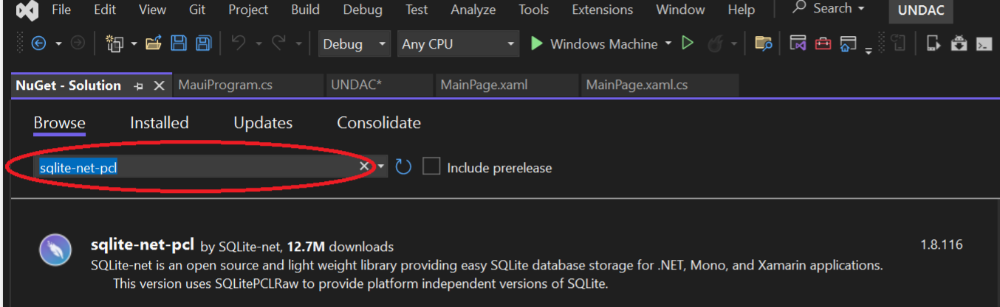
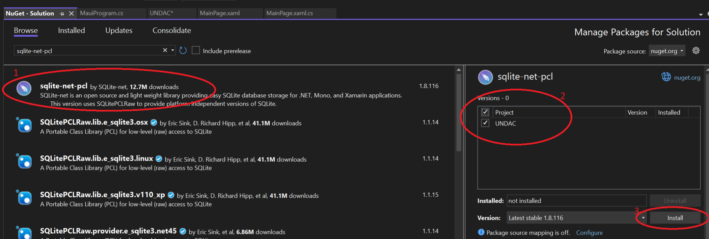
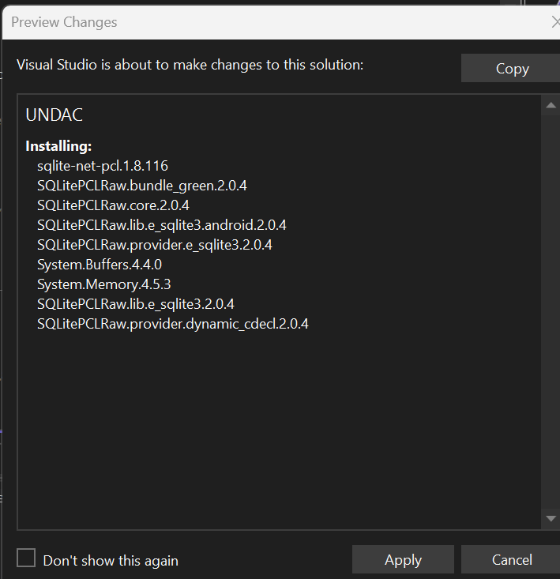

# Software Engineering - SET09102 - Portfolio for week 3 
## Tim Honisett - 40595819

## list of contents
1.  [Geting Starting with .NET MAUI](#geting-starting-with-.net-maui)
2.  [Team Workflow](#team-workflow)
3.  [Import the issue list](#import-the-issue-list)
4.  [Individual development tasks](#individual-development-tasks)
5.  [Continuous integration](#continous-integration)

### Geting Starting with .NET MAUI

Local SQLite database installed into Visual Studio using Nugent Packages. The package used is sqlite-net-plc. To install package, right click on tools in the main menu, Nugent Package Manager than Manage NuGent Packages for Solutions
(See figure 1)

**(figure 1)**

Manage Packages for Solution screen will now appear.  In the Browse tab, enter sqlite-net-pcl in the search bar (see figure 2)

**(figure 2)**

Highlight the package (1), choose the project and solution to add the package to (2) and click on install. (see figure 3)

**(figure 3)**

Click on apply to add changes to the project/solution (see figure 4)

**(figure 4)**

The package will now install

Once the exerices for creating the MAUI and adding SQLite database. The code can be found [here](https://github.com/timh1975/Notes)

### Team Workflow

The team workflow was agreed on 18th September 2023.

A Kanban board using Zube has been set up and will be used, using the following headings

  1.  Tasks
  2.  In Progress
  3.  Blockers
  4.  In Review
  5.  Completed

A pull request will be issued when a developer wishes to merge a feature branch into the development branch

A development branch was created from main branch. All feature branches 

### Import the issue list

The import of the isues have already been undertaken by another team member.  I assigned task 22 to myself.

The next step was to create a feature branch on my local machine followed by pushing it to the remote repo.

### Individual development tasks

### Continous integration
